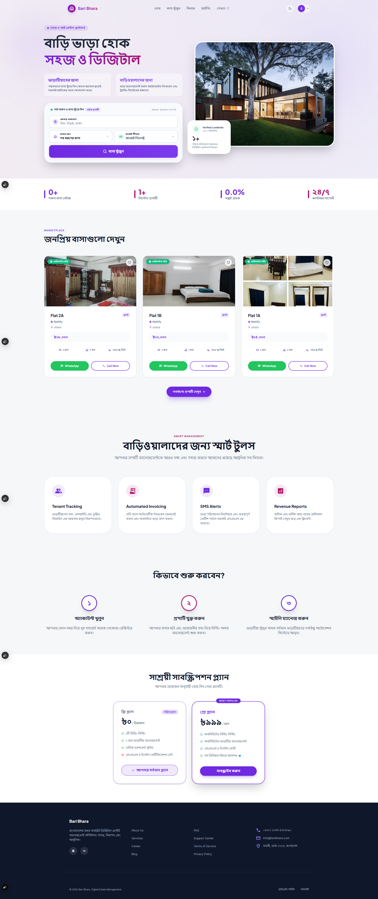
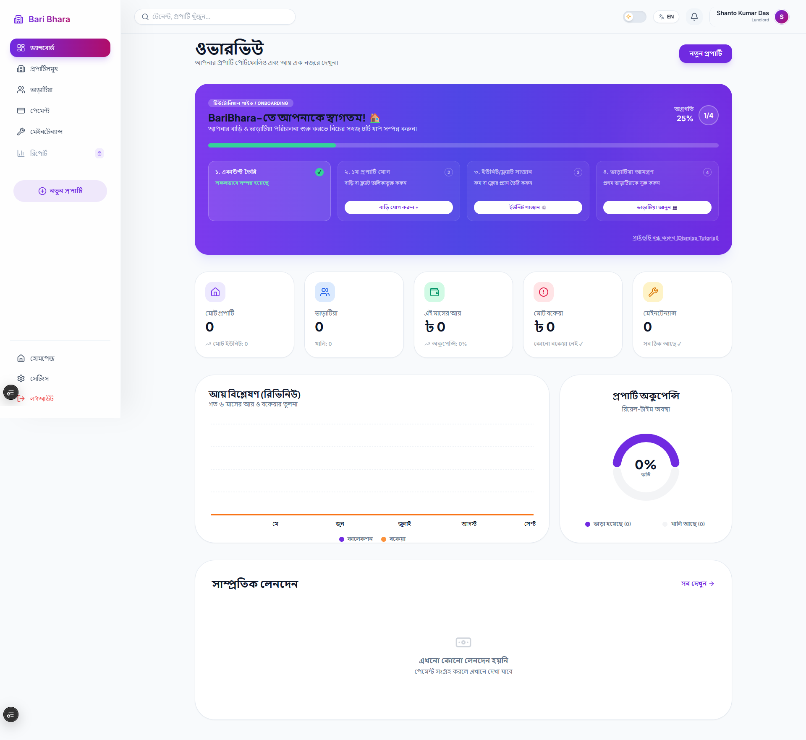
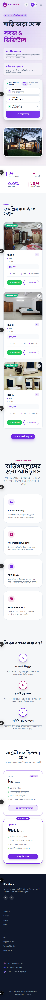

<div align="center">


# 🏢 BariBhara - Frontend (Client App)

### The User Interface for Smart Rental Management

<a href="https://baribhara.vercel.app/">
  
</a>

<p align="center">
  A highly responsive, animated, and installable Progressive Web App (PWA) built for Landlords, Tenants, and Admins to manage properties effortlessly.
</p>

</div>

---

## 📖 Project Overview

**BariBhara** is a smart rental management platform designed to streamline the process of finding, renting, and managing properties. It serves three main types of users:
- **Landlords:** Manage properties, collect rent, track expenses, and view tax-ready PDF reports.
- **Tenants:** Search for rental units, pay rent, manage digital lease agreements, and communicate directly with landlords.
- **Admins:** Oversee the entire platform, manage users, and track platform revenue.

This repository contains the **Frontend (Client App)**, built to provide a modern, seamless, and mobile-friendly experience.

---

## 📸 Screenshots

| Home / Marketplace | Dashboard | Mobile / PWA View |
|:---:|:---:|:---:|
|  |  |  |

---

## ✨ Key Features

- **Interactive Marketplace:** Infinite scrolling, dynamic search, and filtering for rental units.
- **Progressive Web App (PWA):** Installable on mobile and desktop with offline caching capabilities.
- **Biometric Login (WebAuthn):** Fingerprint and Face ID login support using `@simplewebauthn/browser`.
- **NID OCR Scanner:** Camera-based National ID scanning for quick tenant registration via `tesseract.js`.
- **Digital Lease Agreements:** Generate, sign (`react-signature-canvas`), and download PDF rental agreements (`jspdf`).
- **Real-Time Notifications:** Live updates via WebSockets (`socket.io-client`) for maintenance, rent, and chats.
- **Dynamic Dashboards:** Dedicated role-based dashboards featuring interactive charts (`recharts`).
- **Responsive UI/UX:** Styled seamlessly using Tailwind CSS and `shadcn/ui` components.

---

## 🛠️ Tech Stack

### Frontend & Core
- **React 19**
- **Vite**
- **TypeScript**

### State Management & Data Fetching
- **Zustand** (Global state)
- **TanStack React Query** (Server state)
- **Axios** (HTTP client)

### Routing
- **React Router DOM v7**

### Authentication & Security
- **JWT** (JSON Web Tokens)
- **WebAuthn** (`@simplewebauthn/browser`)

### Real-time Communication
- **Socket.io-client**

### PWA
- **vite-plugin-pwa** (Service Worker & Offline Support)

### UI & Styling
- **Tailwind CSS**
- **shadcn/ui**
- **Lucide React** & **Google Material Symbols** (Icons)
- **Framer Motion / tw-animate-css** (Animations)

### Utility & Tools
- **Zod** (Schema Validation)
- **React Hook Form** (Form Handling)
- **jsPDF** & **html2canvas** (PDF Generation)
- **Tesseract.js** (OCR)

---

## 📦 Dependencies

Some of the main direct dependencies that power this project:

- `react` / `react-dom` (^19.2.4)
- `react-router-dom` (^7.14.0)
- `@tanstack/react-query` (^5.99.0)
- `zustand` (^5.0.12)
- `axios` (^1.15.0)
- `tailwindcss` (^3.4.19)
- `socket.io-client` (^4.8.3)
- `zod` (^4.3.6) & `react-hook-form` (^7.72.1)
- `@simplewebauthn/browser` (^13.3.0)
- `jspdf` (^4.2.1) & `html2canvas` (^1.4.1)
- `tesseract.js` (^7.0.0)

---

## 📁 Project Structure

```bash
client/
├── public/                 # Static assets (PWA icons, manifest, screenshots)
├── src/
│   ├── api/                # API service calls
│   ├── components/         # Reusable UI components
│   │   ├── common/         # Global shared components
│   │   ├── modals/         # Dialogs and modals
│   │   └── layout/         # Structural components (Sidebar, Navbar)
│   ├── Hook/               # Custom React hooks
│   ├── pages/              # Route-based page components
│   │   ├── admin/          # Admin Views
│   │   └── tenant/         # Tenant Views
│   ├── store/              # Zustand global state stores
│   ├── schemas/            # Zod validation schemas
│   ├── App.tsx             # Main Router & Layout definition
│   ├── main.tsx            # React root entry
│   └── sw.ts               # Service Worker logic
├── .env                    # Environment variables
├── package.json            # Dependencies and scripts
└── vite.config.ts          # Vite configuration
```

---

## 🚀 Getting Started

Follow these steps to set up the project locally.

### Prerequisites
- **Node.js** 20.x or higher
- **npm** (comes with Node.js)
- The BariBhara Server (Backend) running locally or remotely.

### 1. Clone the repository
```bash
git clone https://github.com/CodeCommandBD/BariBhara-Client.git
cd BariBhara-Client
```

### 2. Install Dependencies
```bash
npm install
```

### 3. Environment Variables
Create a `.env` file in the root of your project and configure it. You can use the following example:

```env
# Development Backend API URL
VITE_API_URL=http://localhost:4000

# Production Backend API URL (Use this for deployment)
# VITE_API_URL=https://your-backend-api.com
```

### 4. Run Development Server
```bash
npm run dev
```
The app will be available at `http://localhost:5173`.

### 5. Build for Production
To create an optimized production build, run:
```bash
npm run build
```

---

## 🔗 Links

- **Live Demo:** [https://baribhara.vercel.app/](https://baribhara.vercel.app/)

---
